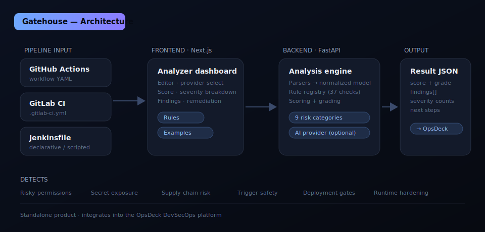

# Gatehouse

**Gatehouse reviews CI/CD pipeline definitions before they reach production.** It parses
GitHub Actions, GitLab CI, and Jenkins pipelines and flags risky permissions, secret
exposure, supply chain gaps, unsafe scripts, and weak deployment gates — with a risk score,
clear findings, and copy-ready remediation.


Gatehouse is the CI/CD pipeline review module of a broader DevOps / DevSecOps platform,
alongside **OpsDeck** (control room), **Podscope** (Kubernetes manifest review), and
**Dockyard** (Dockerfile and container build review). It runs perfectly well on its own and
exports a stable JSON contract so OpsDeck can ingest its results later.

---

## Why it exists

Pipelines are production control planes. They hold credentials, deploy infrastructure,
publish packages, and often have direct access to cloud accounts — yet pipeline changes
frequently merge with far less review than application code. Gatehouse adds a fast,
deterministic review layer that fits in front of a merge or a deploy, so risky changes get
caught before they run on a privileged runner.

## What it detects

Gatehouse ships **37 checks across nine categories**:

| Category | Examples |
| --- | --- |
| **Permissions** | `write-all`, sensitive `*: write` at workflow scope, unused `id-token: write`, missing permission defaults |
| **Secrets** | hardcoded credentials, echoed secrets, Docker `--build-arg` leaks, `.env`/kubeconfig in artifacts, literal key patterns |
| **Supply Chain** | unpinned actions, branch/tag pins instead of SHAs, `curl \| bash`, installs from arbitrary URLs, missing provenance/SBOM |
| **Trigger Safety** | `pull_request_target` checking out fork code, unscoped deploy branches, privileged scheduled runs, over-broad GitLab rules |
| **Deployment Safety** | deploys without approval gates, `kubectl apply` without validation, `terraform apply` without a reviewed plan, unsafe SSH |
| **Artifacts & Cache** | workspace-root artifact paths, long retention, overly broad caches |
| **Runtime Scripts** | `chmod 777`, inline Docker password, Docker socket mounts, privileged / DinD, `set -x` around secrets, missing fail-fast |
| **Reliability** | missing job timeouts, no concurrency control, deploy without a test stage |
| **Maintainability** | missing workflow name, no Jenkins `post`/failure handling |

The full catalog is browsable in the app under **Rules**, or via `GET /api/rules`.

## Architecture



```text
gatehouse
├── apps/
│   ├── api/                 FastAPI service
│   │   └── app/
│   │       ├── parsers/     provider detection + line-aware parsers (GH / GitLab / Jenkins)
│   │       ├── analysis/    rule registry, rule modules, scoring engine
│   │       ├── ai/          optional AI provider abstraction (off by default)
│   │       ├── services/    example catalog
│   │       └── api/         HTTP routes
│   └── web/                 Next.js dashboard (App Router)
│       ├── app/             Analyze, Rules, Examples, Docs pages
│       ├── components/      editor, score panel, finding cards, sidebar
│       └── e2e/             Playwright tests
├── examples/                safe demo pipelines
├── docs/                    images + integration contract
└── docker-compose.yml
```

The analysis flow is intentionally simple and explainable:


## Tech stack

FastAPI · Pydantic v2 · PyYAML · Next.js 14 · TypeScript · Docker Compose · Pytest · Playwright

---

## Quick start (Docker Compose)

```bash
cp .env.example .env
docker compose up --build
```

- Dashboard: <http://localhost:3000>
- API + docs: <http://localhost:8000> · <http://localhost:8000/docs>

## Manual backend setup

```bash
cd apps/api
python -m venv .venv
source .venv/bin/activate            # Windows: .venv\Scripts\activate
pip install -r requirements.txt
uvicorn app.main:app --reload --port 8000
```

## Manual frontend setup

```bash
cd apps/web
npm install
npm run dev                          # http://localhost:3000
```

Set `NEXT_PUBLIC_API_BASE_URL` if the API is not on `http://localhost:8000`.

---

## API

| Method | Path | Description |
| --- | --- | --- |
| `GET` | `/health` | Liveness probe |
| `GET` | `/ready` | Readiness, rule count, AI provider |
| `GET` | `/api/rules` | Rule catalog |
| `GET` | `/api/examples` | Demo pipelines |
| `GET` | `/api/examples/{id}` | A single example |
| `POST` | `/api/analyze` | Analyze a pipeline |
| `POST` | `/api/ai/summarize` | Optional AI risk summary |
| `POST` | `/api/ai/remediate` | Optional AI remediation for a finding |

### `POST /api/analyze`

Request:

```jsonc
{
  "content": "<pipeline text>",
  "platform": "auto",              // auto | github_actions | gitlab_ci | jenkins
  "project_name": "checkout",      // optional
  "repository": "org/checkout",    // optional
  "environment": "production",     // optional
  "strict_mode": false,            // optional, stricter defaults
  "enabled_categories": ["Secrets", "Permissions"]   // optional filter
}
```

Response (abridged):

```jsonc
{
  "schema_version": "1.0",
  "score": 14,
  "grade": "F",
  "score_breakdown": { "checks_passed": 28, "checks_failed": 9, "explanation": "..." },
  "provider": "github_actions",
  "triggers": ["push"],
  "jobs": [{ "name": "deploy", "steps": 3, "uses_secrets": true, "line": 7 }],
  "permissions_summary": [{ "scope": "*", "access": "write" }],
  "severity_counts": { "critical": 1, "high": 2, "medium": 4, "low": 0, "info": 2 },
  "findings": [ /* id, title, severity, category, line, impact, remediation, safer_example */ ],
  "recommended_next_steps": ["..."]
}
```

### Example with curl

```bash
curl -s http://localhost:8000/api/analyze \
  -H "Content-Type: application/json" \
  -d '{"platform":"github_actions","content":"name: ci\non: [push]\npermissions: write-all\njobs:\n  build:\n    runs-on: ubuntu-latest\n    steps:\n      - uses: actions/checkout@v3"}' | jq '.score, .grade'
```

---

## Scoring model

Every pipeline starts at **100**. Each finding subtracts points by severity
(critical 28, high 18, medium 9, low 3) scaled by the finding's confidence. The score is
floored at 0 and mapped to a grade:

| Grade | Score |
| --- | --- |
| A | 90–100 |
| B | 75–89 |
| C | 60–74 |
| D | 40–59 |
| F | 0–39 |

The response always includes the score breakdown (checks passed/failed and a plain-English
explanation), severity counts, category counts, detected provider, and jobs/stages analyzed.

## AI features (optional)

AI is **off by default** — the deterministic analyzer is fully functional without it.
The AI layer is a small provider abstraction (`app/ai/`):

- `AI_PROVIDER=none` (default): the AI endpoints return a disabled response.
- `AI_PROVIDER=deterministic`: a built-in, no-API-key assistant returns template-based risk
  summaries and remediation in the same response shape a model provider would use.
- Model-backed providers (OpenAI / Anthropic / local) can be added in `app/ai/providers.py`
  later without changing any caller. **No real keys are committed to this repository.**

Planned AI use cases the abstraction is shaped for: natural-language risk summary, "explain
this finding", "what should I fix first", and generating hardened pipeline snippets.

## Testing

Backend:

```bash
cd apps/api
python -m compileall app      # syntax check
pytest                        # parser, analyzer, scoring, API, and AI tests
```

Frontend:

```bash
cd apps/web
npm install
npm run typecheck
npm run build
```

End-to-end (Playwright):

```bash
cd apps/web
npm run test:e2e:install      # one-time: download the Chromium browser
npm run test:e2e              # boots the API + web automatically, then runs the flows
```

The E2E suite loads a risky sample, runs analysis, asserts the score and findings, loads the
hardened workflow and asserts a higher score, and exercises a GitLab sample and the Rules page.

---

## Roadmap

- PR / merge-request comment writer (GitHub, GitLab)
- SARIF export for code-scanning dashboards
- Team baseline profiles and pipeline drift detection
- Richer Jenkins scripted-pipeline parsing
- Azure DevOps, Bitbucket Pipelines, and CircleCI providers
- "Merge risk" summary and release-manager checklist output
- OpsDeck connector (webhook push of completed runs)

## OpsDeck integration

Gatehouse is standalone but integration-ready. `POST /api/analyze` returns a versioned,
stable schema (`schema_version`) that OpsDeck can store as a module run and roll up alongside
Podscope and Dockyard. See [docs/integration.md](docs/integration.md) for the full contract.

## Security notes

Gatehouse only reads pipeline text you provide; it never executes it. Do not paste real
secrets into the UI. The bundled examples are safe demo files — any token-like strings in them
are fake. If Gatehouse flags a committed credential in your own pipeline, rotate it and remove
it from history using your organization's approved process.

## Contributing

1. Add a rule as a small function in `apps/api/app/analysis/rules/` decorated with `@rule(...)`
   — it is auto-registered and picked up by the engine, the catalog, and the scoring model.
2. Add or extend an example in `examples/` and the catalog in `app/services/examples.py`.
3. Run `pytest` and `npm run typecheck` before opening a PR.

## License

No license has been selected yet.
