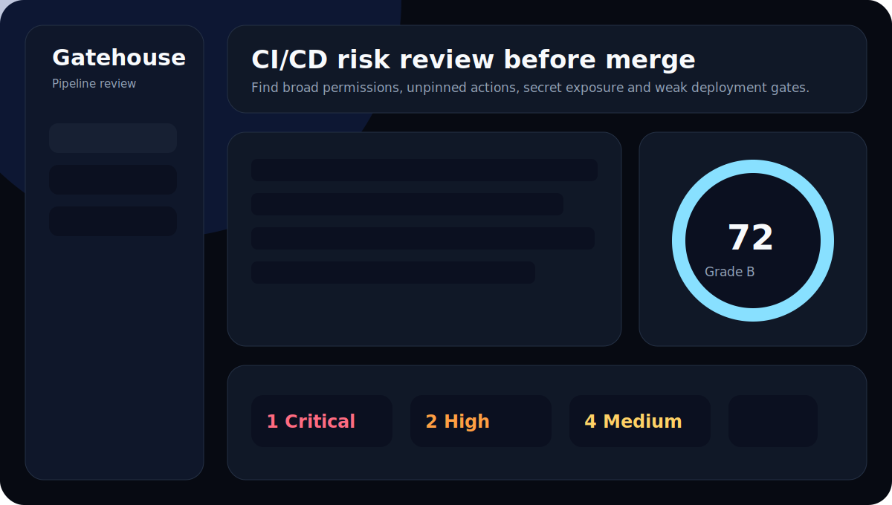
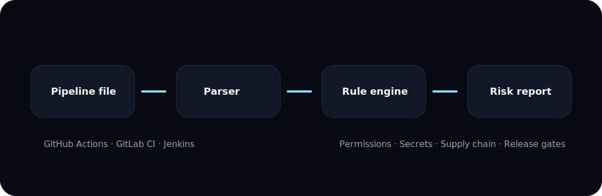

# Gatehouse

Gatehouse is a CI/CD pipeline review tool for DevOps, DevSecOps, platform engineering, and release teams. It reviews GitHub Actions, GitLab CI, and Jenkins pipeline definitions for risky permissions, secret exposure, unsafe shell execution, unpinned dependencies, weak runner hygiene, and missing deployment guardrails.



## Why Gatehouse exists

Modern delivery pipelines are production control planes. They hold credentials, deploy infrastructure, publish packages, run container builds, and often have direct access to cloud environments. Gatehouse gives teams a lightweight review layer before pipeline changes reach protected branches or production runners.

Gatehouse is designed as the fourth standalone module in a broader DevOps and DevSecOps platform ecosystem:

- OpsDeck: core DevOps control room
- Podscope: Kubernetes manifest review
- Dockyard: Dockerfile and container build review
- Gatehouse: CI/CD pipeline review

## What it detects

Gatehouse currently focuses on practical CI/CD risks:

- Broad GitHub Actions token permissions
- `write-all` workflow permissions
- Sensitive write permissions at workflow scope
- Unpinned GitHub Actions references
- Mutable tags such as `@main`, `@master`, `@v3`, or `@latest`
- Secret-like variable names and literal credential patterns
- Remote script execution such as `curl | bash`
- Dangerous shell patterns such as `chmod 777` or password-based Docker login
- Missing job timeouts
- Deployment-like jobs without visible environment or manual gates
- GitLab Docker-in-Docker and privileged runner patterns
- Jenkinsfile secret handling and shell execution risks

## Architecture



Gatehouse has a small modular architecture:

```text
gatehouse
├── apps/api      FastAPI analyzer API
├── apps/web      Next.js dashboard and editor
├── examples      Demo pipelines
├── docs/images   Local README assets
└── docker-compose.yml
```

## Tech stack

- FastAPI
- Pydantic
- PyYAML
- Next.js
- TypeScript
- Docker Compose
- Pytest

## Quick start

```bash
docker compose up --build
```

Open:

```text
http://localhost:3000
```

API:

```text
http://localhost:8000
```

## Manual backend setup

```bash
cd apps/api
python -m venv .venv
source .venv/bin/activate
pip install -r requirements.txt
uvicorn app.main:app --reload --host 0.0.0.0 --port 8000
```

On Windows PowerShell:

```powershell
cd apps\api
python -m venv .venv
.venv\Scripts\activate
pip install -r requirements.txt
uvicorn app.main:app --reload --host 0.0.0.0 --port 8000
```

## Manual frontend setup

```bash
cd apps/web
npm install
npm run dev
```

## API endpoints

```text
GET  /health
GET  /ready
GET  /api/rules
GET  /api/examples
GET  /api/examples/{example_id}
POST /api/analyze
```

## Example API usage

```bash
curl -X POST http://localhost:8000/api/analyze \
  -H "Content-Type: application/json" \
  -d '{"platform":"github_actions","content":"name: test\non: push\njobs:\n  build:\n    runs-on: ubuntu-latest\n    steps:\n      - uses: actions/checkout@v3"}'
```

## Scoring model

Gatehouse starts from 100 and subtracts points based on severity and confidence:

- Critical: high impact on score
- High: major deployment or credential risk
- Medium: practical hardening gap
- Low: reliability or hygiene issue
- Info: contextual guidance

The result includes:

- Score
- Grade
- Severity counts
- Category counts
- Jobs analyzed
- Findings
- Recommended next steps

## Integration contract

Gatehouse is intentionally designed to integrate with OpsDeck later. The `/api/analyze` response is stable JSON with:

- Pipeline metadata
- Jobs
- Findings
- Severity counts
- Category counts
- Score and grade
- Recommended next steps

OpsDeck can ingest this response as a module run result without needing to know the internal rule engine.

## Environment variables

```text
CORS_ORIGINS=http://localhost:3000,http://127.0.0.1:3000
NEXT_PUBLIC_API_BASE_URL=http://localhost:8000
AI_PROVIDER=none
```

AI is intentionally disabled by default. Future versions can add provider-based summarization and remediation without making the deterministic analyzer depend on an API key.

## Testing

Backend tests:

```bash
cd apps/api
pytest
```

Python syntax check:

```bash
cd apps/api
python -m compileall app
```

Frontend type check:

```bash
cd apps/web
npm install
npm run typecheck
```

Frontend build:

```bash
cd apps/web
npm run build
```

Docker configuration check:

```bash
docker compose config
```

## Roadmap

- More complete GitHub Actions permission modeling
- GitLab protected environment checks
- Jenkins declarative and scripted pipeline parser improvements
- GitHub PR comment output
- GitLab merge request comment output
- SARIF export
- OpsDeck module connector
- Optional AI remediation assistant
- Playwright E2E tests
- Policy baseline profiles per team
- CI/CD review gate mode

## Security notes

Gatehouse analyzes pipeline configuration text. Do not paste real secrets into the UI. If a committed secret is detected, rotate it and remove it from history using your organization-approved process.

## License

No license has been selected yet.
